# Controle Rural Simples — Documentação completa

**Versão documentada:** 16 de setembro de 2026
**Site:** <https://rafael26ti-sys.github.io/>  
**Repositório:** <https://github.com/rafael26ti-sys/rafael26ti-sys.github.io>  
**Backend:** Supabase  
**Objetivo:** organizar a operação de uma propriedade rural de forma simples, segura e utilizável mesmo quando a conexão com a internet é instável.

> Este documento descreve o comportamento implementado no código e no projeto Supabase na data acima. Ele serve como referência funcional, técnica, de segurança e de operação.

## Sumário

1. [Visão do produto](#1-visão-do-produto)
2. [Escopo implementado](#2-escopo-implementado)
3. [Arquitetura do sistema](#3-arquitetura-do-sistema)
4. [Perfis de acesso](#4-perfis-de-acesso)
5. [Jornadas de autenticação e equipe](#5-jornadas-de-autenticação-e-equipe)
6. [Processos dos módulos](#6-processos-dos-módulos)
7. [Notificações](#7-notificações)
8. [Modo offline e sincronização](#8-modo-offline-e-sincronização)
9. [Modelo de dados](#9-modelo-de-dados)
10. [Funções, gatilhos e automações](#10-funções-gatilhos-e-automações)
11. [RLS e segurança](#11-rls-e-segurança)
12. [Arquivos e responsabilidades](#12-arquivos-e-responsabilidades)
13. [Publicação e operação](#13-publicação-e-operação)
14. [Testes e critérios de aceite](#14-testes-e-critérios-de-aceite)
15. [Limitações e pendências](#15-limitações-e-pendências)
16. [Próximos passos recomendados](#16-próximos-passos-recomendados)
17. [Glossário](#17-glossário)

## 1. Visão do produto

O Controle Rural Simples atende donos de fazenda e seus funcionários. O sistema reúne informações financeiras e operacionais em um painel único, separa os dados por propriedade e aplica permissões conforme o cargo.

### 1.1 Usuários

| Perfil | Necessidade principal | Resultado esperado |
|---|---|---|
| Dono da fazenda | Administrar a propriedade e a equipe | Visão completa, indicadores, financeiro, relatórios e controle de acesso |
| Vaqueiro | Cuidar do rebanho e executar tarefas | Agenda própria, animais, prontuário e registros de campo |
| Caseiro | Apoiar a rotina operacional | Agenda, plantações, estoque, máquinas e registros de campo |
| Administrador do projeto | Atender contatos enviados pelo site público | Acesso restrito às mensagens de contato |

### 1.2 Princípios

- linguagem simples e interface responsiva;
- isolamento de dados entre propriedades;
- menor privilégio possível para cada cargo;
- registro das alterações importantes;
- funcionamento básico no campo sem internet;
- sincronização segura e repetível ao reconectar;
- uso da chave pública do Supabase no navegador e proteção real no banco por RLS.

## 2. Escopo implementado

### 2.1 Páginas

| Página | Finalidade | Acesso |
|---|---|---|
| Página inicial | Apresentação, benefícios, chamada para cadastro e contato | Público |
| Login e cadastro | Entrar, criar conta e concluir vínculo com uma fazenda | Público |
| Redefinição de senha | Definir uma nova senha após o link de recuperação | Link seguro do Supabase |
| Painel | Indicadores, módulos operacionais, equipe, perfil e mensagens | Usuário autenticado |

### 2.2 Módulos

| Módulo | Recursos principais | Persistência |
|---|---|---|
| Painel | Saldo, receitas, despesas, animais, tarefas, alertas e clima | Supabase + cópia offline |
| Financeiro | Receitas, despesas, filtros, gráfico e resultado | Supabase + fila offline |
| Agenda | Tarefas, prioridade, atribuição e conclusão | Supabase + fila offline |
| Animais | Cadastro, categoria do gado, peso, vacinação e situação | Supabase + fila offline |
| Prontuário animal | Vacina, saúde, medicamento e pesagem | Supabase; requer internet |
| Produção de leite | Ordenhas por vaca, turno, descarte, totais e média diária | Supabase + fila offline |
| Plantações | Cultura, área, datas, produção, custo e situação | Supabase + fila offline |
| Estoque | Itens, mínimo, entradas e saídas | Supabase + fila offline |
| Máquinas | Equipamentos, horas, combustível e manutenção | Supabase + fila offline |
| Equipe | Convites, cargos, ativação e desativação | Supabase; requer internet |
| Histórico | Autor, módulo, ação e campos alterados | Supabase; requer internet |
| Relatórios | Resultado, gastos e resumos operacionais | Dados do Supabase; PDF pelo navegador |
| Clima | Condição atual, sete dias e alertas | Open-Meteo + último resultado em cache |
| Notificações | Avisos internos, Realtime e Web Push | Supabase + navegador |
| Perfil | Alteração segura do próprio nome | Edge Function |
| Mensagens | Atendimento dos contatos públicos | Supabase; administrador do projeto |

## 3. Arquitetura do sistema

### 3.1 Visão geral

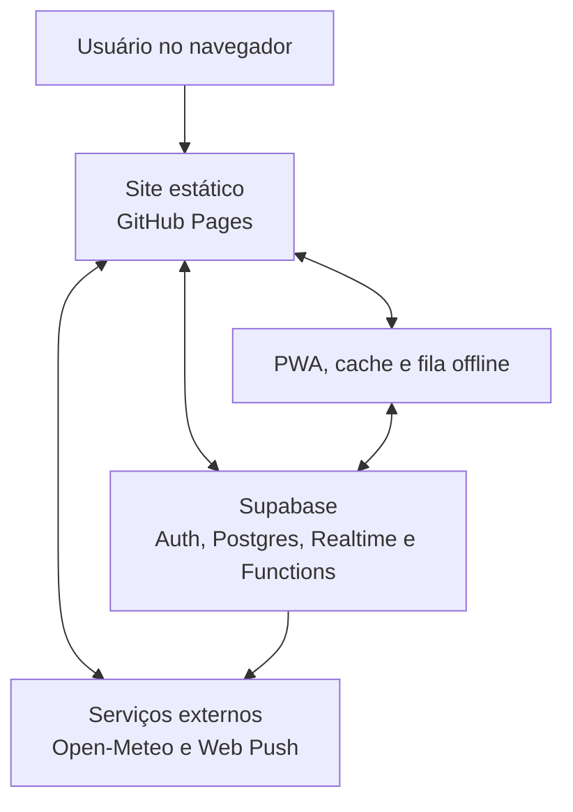

### 3.2 Camadas

| Camada | Tecnologia | Responsabilidade |
|---|---|---|
| Apresentação | HTML e CSS | Páginas, formulários, modais, tabelas e responsividade |
| Aplicação | JavaScript modular | Validação, navegação, regras de interface e coordenação dos módulos |
| Acesso a dados | supabase-js 2.112.4 | Auth, consultas, mutations, RPC, Realtime e Edge Functions |
| Offline | Service Worker + localStorage | App shell, snapshots locais, fila e retomada |
| Backend | Supabase | Postgres, RLS, Auth, Realtime, RPC, triggers e funções |
| Integrações | Open-Meteo e Web Push | Clima, geocodificação e avisos externos |
| Hospedagem | GitHub Pages | Entrega dos arquivos estáticos por HTTPS |

### 3.3 Fronteiras de confiança

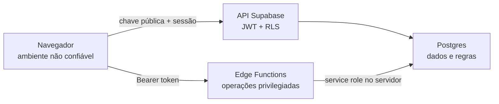

Regras importantes:

- nunca confiar no cargo enviado pelo navegador;
- validar fazenda, usuário e cargo no banco;
- nunca publicar a service role key no repositório ou no JavaScript;
- toda tabela acessível pela API pública deve ter RLS e políticas explícitas;
- funções com privilégios elevados devem validar o chamador e fixar o search path.

## 4. Perfis de acesso

### 4.1 Matriz funcional

Legenda: **A** administra, **E** executa/edita, **V** visualiza, **—** sem acesso.

| Recurso | Dono | Vaqueiro | Caseiro |
|---|---:|---:|---:|
| Painel geral | A | V | V |
| Valores financeiros | A | — | — |
| Receitas e despesas | A | — | — |
| Criar e atribuir tarefas | A | — | — |
| Concluir tarefa própria ou da equipe | A | E | E |
| Animais | A | E | V |
| Prontuário animal | A | E | V |
| Produção de leite | A | E | E |
| Plantações | A | V | E |
| Itens de estoque | A | V | E |
| Movimentar estoque | A | E | E |
| Máquinas | A | V | E |
| Registrar uso, combustível ou manutenção | A | E | E |
| Relatórios financeiros | A | — | — |
| Relatórios operacionais | A | V | V |
| Equipe e convites | A | — | — |
| Histórico da propriedade | A | — | — |
| Editar próprio perfil | E | E | E |

### 4.2 Regras transversais

- o acesso só existe enquanto o vínculo em farm_members estiver ativo;
- cada consulta usa o identificador da fazenda ativa;
- o dono pode desativar um funcionário sem apagar o histórico;
- somente o dono pode excluir os registros principais;
- tarefas destinadas a uma pessoa só podem ser concluídas por ela ou pelo dono;
- tarefas destinadas à equipe podem ser concluídas por qualquer membro ativo;
- o cargo não pode ser alterado pelo próprio usuário na tela de perfil.

## 5. Jornadas de autenticação e equipe

### 5.1 Criação da conta do dono

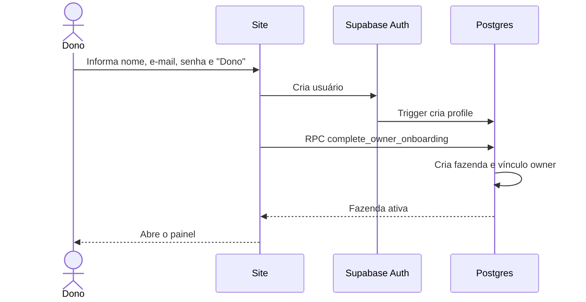

Condições:

- e-mail válido;
- senha aceita pelas regras do Supabase;
- nome da propriedade obrigatório;
- cada operação usa auth.uid() para identificar o usuário real;
- a confirmação de e-mail está desativada no projeto, portanto o acesso é imediato.

### 5.2 Entrada de vaqueiro ou caseiro

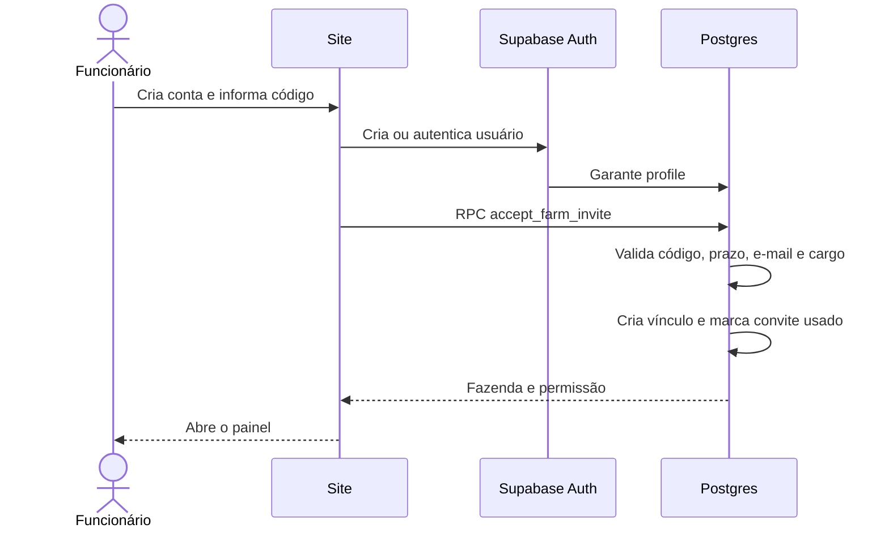

O código é criado pelo dono na página Equipe, vale por sete dias e pode ser cancelado antes do uso. Quando o convite contém um e-mail, somente essa conta pode aceitá-lo.

### 5.3 Gestão da equipe

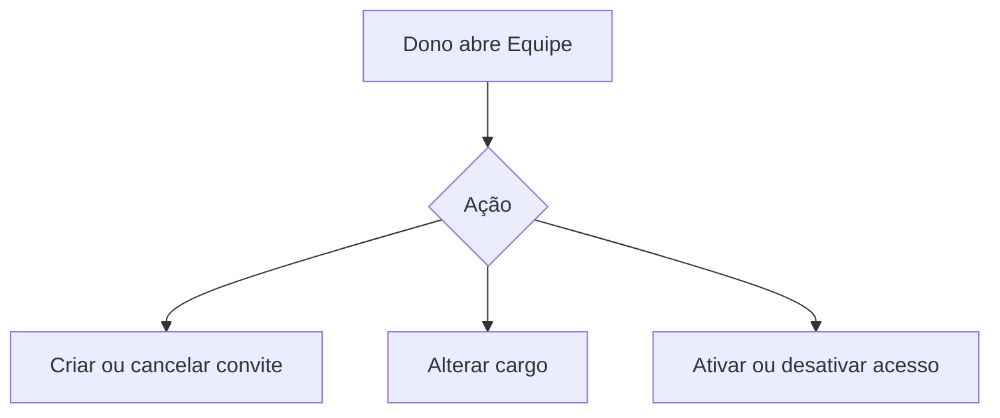

As alterações são protegidas por políticas de proprietário e entram no histórico da fazenda.

### 5.4 Login e sessão

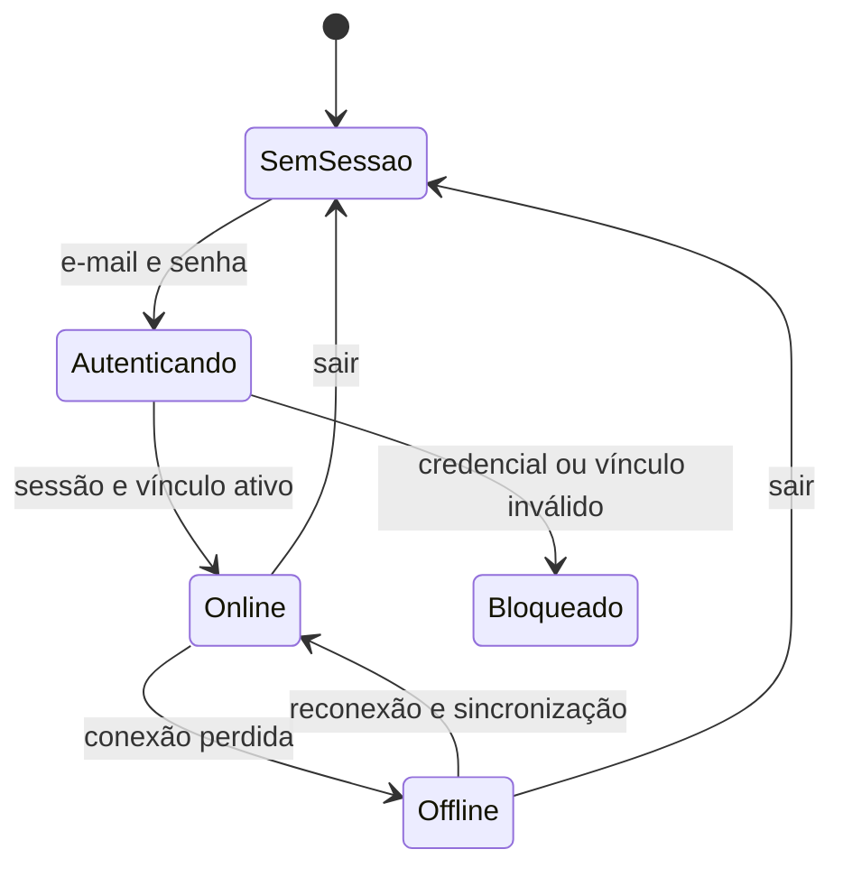

Na entrada:

1. o cliente recupera a sessão persistida;
2. o Supabase confirma o usuário;
3. o sistema busca profile, farm_members e farms;
4. o painel é liberado conforme o cargo;
5. um registro local de acesso é renovado por até sete dias para uso offline.

### 5.5 Recuperação e troca de senha

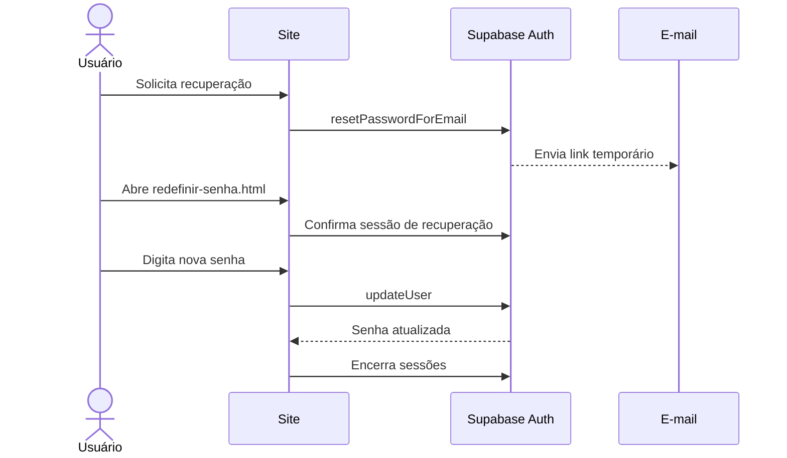

O site não revela se um e-mail está cadastrado. Em produção, o SMTP e a URL de redirecionamento precisam estar configurados no Supabase.

### 5.6 Edição do perfil

O usuário envia apenas o novo nome para a Edge Function update-profile. A função valida o JWT, limita e normaliza o texto e grava somente o profile associado ao usuário autenticado. Cargo, fazenda e identificador não podem ser alterados por essa função.

## 6. Processos dos módulos

### 6.1 Padrão de cadastro e edição

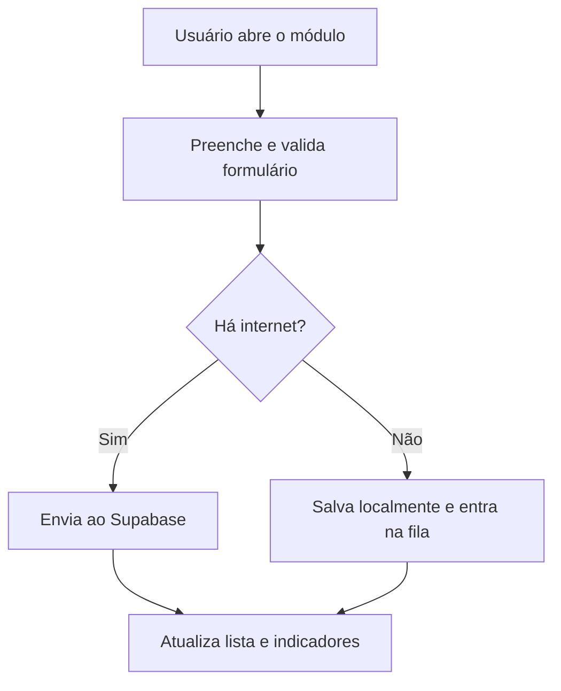

Na edição, o formulário é preenchido com o registro existente. A chave do registro é preservada, os campos são validados novamente e a tabela é atualizada. A exclusão exige confirmação e respeita o cargo.

### 6.2 Painel principal

O painel consolida:

- saldo do mês = receitas do mês menos despesas do mês;
- total de receitas e total de despesas;
- quantidade de animais ativos;
- produção de leite registrada no dia;
- tarefas pendentes e próximas;
- alertas de estoque, vacinação, colheita, manutenção e clima;
- previsão do tempo da localização cadastrada ou pesquisada.

Funcionários não recebem dados financeiros. Essa proteção existe na interface e, principalmente, nas políticas RLS de transactions.

### 6.3 Financeiro

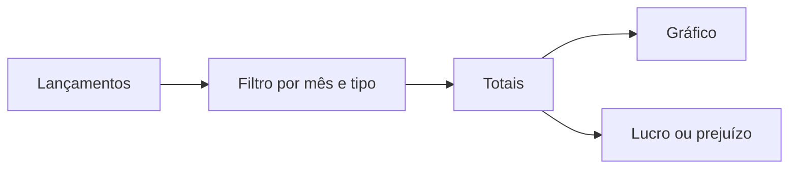

Dados: tipo, data, descrição, categoria, valor e observações. Valores precisam ser positivos. O tipo determina se o lançamento entra como receita ou despesa.

Fórmula:

**Resultado do mês = soma das receitas − soma das despesas**

- resultado maior ou igual a zero: lucro/saldo positivo;
- resultado menor que zero: prejuízo/saldo negativo.

### 6.4 Agenda rural

O dono cadastra título, data, categoria, prioridade, responsável e observações. O responsável pode ser um membro específico ou toda a equipe.

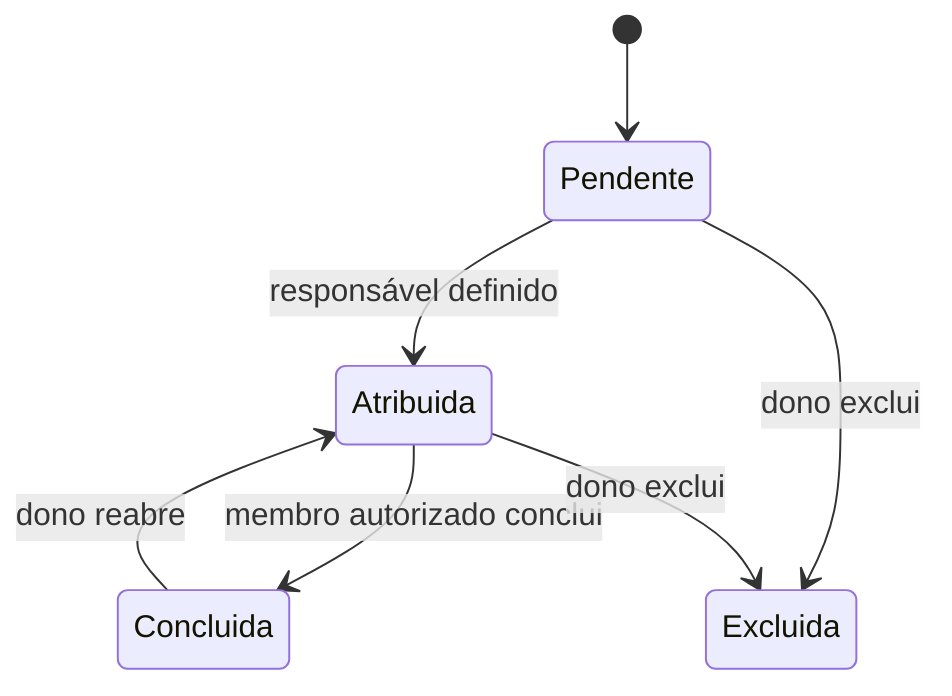

A conclusão passa pela RPC set_task_completion, que confere a sessão, a fazenda e a atribuição antes de alterar a tarefa.

### 6.5 Animais e prontuário

O cadastro contém identificação, espécie, raça, nascimento, peso, vacinas aplicadas, próxima vacinação e observações de saúde. Para bovinos, também registra uma das categorias bezerro, novilha, vaca, boi ou touro. No modo de edição, o animal pode permanecer ativo ou ser marcado como vendido ou morto, com a data correspondente. A tela permite pesquisar e filtrar o rebanho por categoria e situação, preservando os animais inativos no histórico.

O prontuário registra:

- vacina;
- ocorrência de saúde;
- pesagem;
- medicamento.

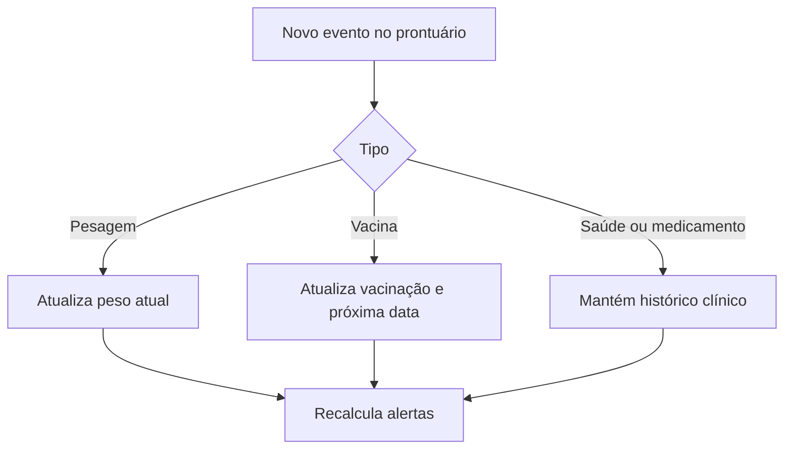

O histórico é cronológico. Vaqueiro e dono podem registrar e editar; somente o dono pode excluir.

### 6.6 Produção diária de leite

Cada ordenha registra vaca, data, turno, litros produzidos, litros descartados e observações. O módulo calcula produção total, leite aproveitado, descarte e média por vaca para o dia selecionado.

Dono, vaqueiro e caseiro podem criar registros. Funcionários editam apenas os registros criados pela própria conta; o dono pode editar ou excluir qualquer registro da propriedade. A vaca selecionada precisa pertencer à mesma fazenda e estar ativa no momento do cadastro.

### 6.7 Plantações

Campos: cultura, área plantada, plantio, previsão e data de colheita, quantidade, unidade, custos, situação e observações.

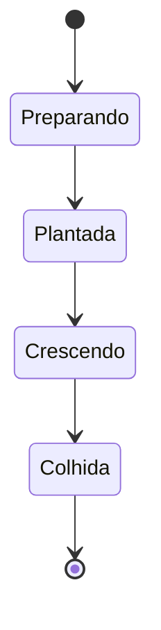

O caseiro e o dono podem cadastrar e editar. A exclusão é exclusiva do dono.

### 6.8 Estoque

O item guarda nome, categoria, quantidade atual, unidade, quantidade mínima e local de armazenamento.

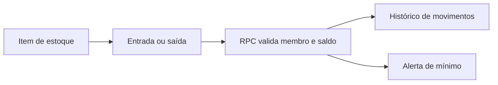

Uma entrada soma quantidade. Uma saída reduz quantidade e não deve produzir saldo inválido. A movimentação usa uma função transacional para gravar o histórico e atualizar o total de forma consistente.

Alerta: **quantidade atual menor ou igual à quantidade mínima**.

### 6.9 Máquinas e equipamentos

O cadastro guarda nome, tipo, marca, modelo, ano, horas, combustível, manutenções, custo de conserto e situação.

Atividades:

- uso: acrescenta horas trabalhadas;
- abastecimento: acrescenta combustível;
- manutenção: registra custo, data e próxima manutenção;
- atualização de situação: disponível, trabalhando ou em manutenção.

Cada atividade gera uma entrada em machine_records e atualiza o resumo da máquina pela RPC record_machine_activity.

### 6.10 Relatórios

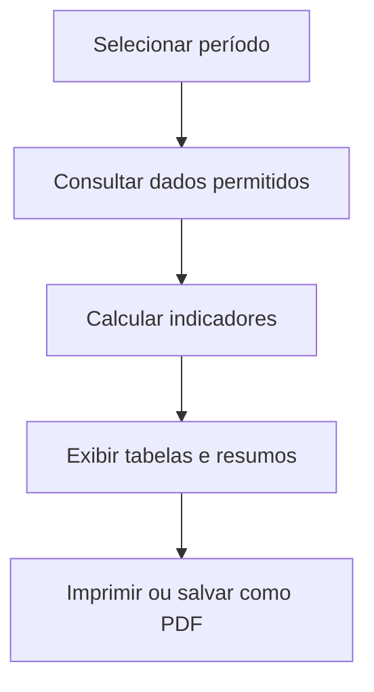

Relatórios implementados:

- lucro mensal;
- gastos por categoria;
- resumo das plantações e produção;
- desempenho e situação dos animais;
- estoque atual e itens abaixo do mínimo;
- máquinas, uso e manutenção.

O PDF é produzido pelo recurso de impressão do navegador. Não há arquivo armazenado no Supabase.

### 6.11 Clima e alertas

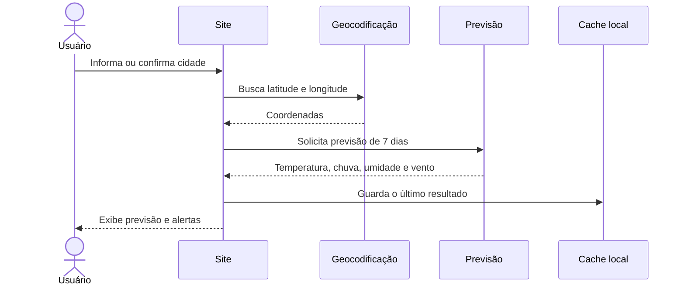

São gerados alertas indicativos de tempestade, chuva forte, geada, vento e tempo seco. Eles não substituem os avisos da Defesa Civil ou de serviços meteorológicos oficiais.

### 6.12 Contato público

O formulário valida os campos no navegador e no banco, usa um campo invisível contra robôs e limita envios repetidos. Visitantes podem inserir uma mensagem, mas não podem listar mensagens. Apenas usuários registrados em private.contact_admins acessam e atualizam o atendimento.

### 6.12 Histórico da propriedade

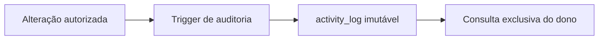

O registro contém fazenda, autor, nome, cargo, módulo, ação, registro afetado, campos alterados e data. O histórico começa na ativação do recurso; ele não reconstrói mudanças anteriores.

## 7. Notificações

### 7.1 Aviso dentro do aplicativo

Quando uma tarefa é criada ou tem a atribuição alterada, um trigger gera uma notificação para cada destinatário. O painel consulta as notificações do usuário e assina eventos INSERT e UPDATE por Supabase Realtime.

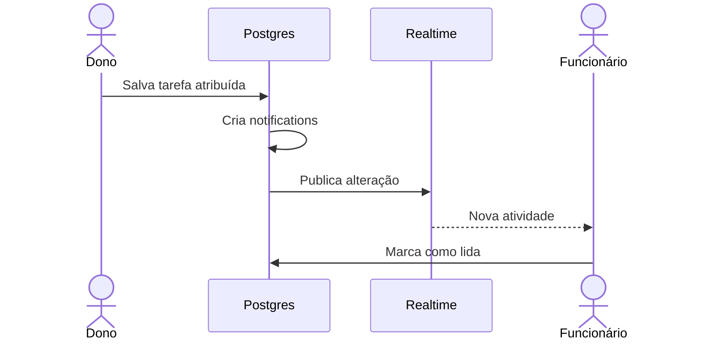

### 7.2 Web Push

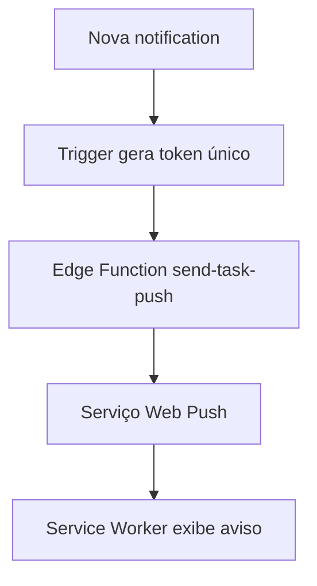

Processo:

1. o usuário autoriza notificações no aparelho;
2. a assinatura do navegador é registrada pela Edge Function;
3. uma notificação nova dispara uma chamada com token de uso único;
4. a Edge Function valida e consome o token;
5. o Web Push envia a mensagem;
6. o Service Worker exibe o aviso e abre a tarefa quando tocado.

No iPhone, o site precisa ser instalado na Tela de Início antes da ativação. Cada navegador e aparelho possui sua própria autorização.

## 8. Modo offline e sincronização

### 8.1 O que funciona offline

| Recurso | Consulta offline | Alteração offline |
|---|---:|---:|
| Painel e últimos indicadores | Sim | Não aplicável |
| Financeiro | Sim | Sim |
| Agenda | Sim | Sim |
| Animais | Sim | Sim |
| Produção de leite | Sim | Sim |
| Plantações | Sim | Sim |
| Estoque | Sim | Sim |
| Máquinas | Sim | Sim |
| Concluir tarefa | Sim | Sim |
| Movimentar estoque | Sim | Sim |
| Registrar atividade de máquina | Sim | Sim |
| Perfil, Equipe e histórico | Não | Não |
| Prontuário animal | Não | Não |
| Mensagens e notificações | Parcial | Não |
| Clima | Último resultado | Não |

### 8.2 Armazenamento local

| Chave lógica | Conteúdo | Escopo |
|---|---|---|
| offline.accounts.v1 | Usuários previamente verificados e validade | Aparelho |
| offline.snapshot.v1 | Última cópia consistente dos módulos | Usuário + fazenda |
| offline.queue.v1 | Operações ainda não confirmadas | Usuário + fazenda |

Não são guardadas senhas. O acesso offline expira sete dias após a última verificação online.

### 8.3 Estados da sincronização

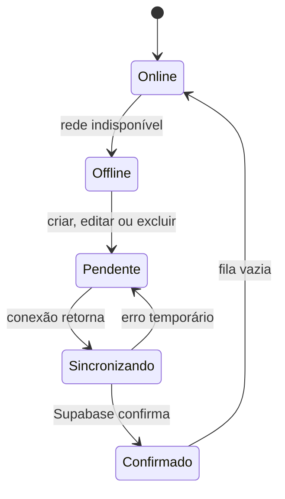

### 8.4 Fluxo de reconexão

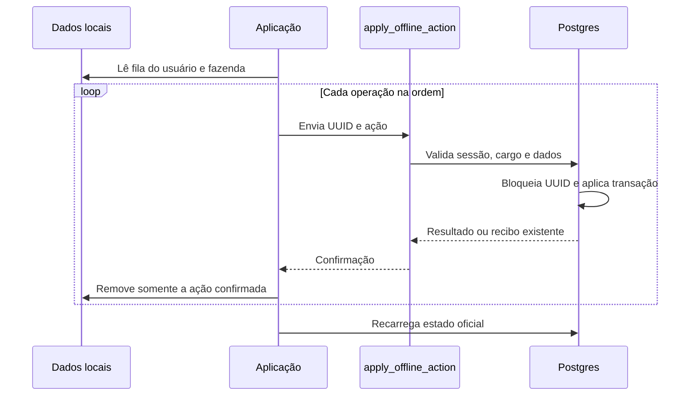

Garantias:

- cada operação recebe UUID criado no aparelho;
- o servidor usa offline_sync_receipts para evitar aplicação duplicada;
- operações concorrentes com o mesmo UUID usam bloqueio transacional;
- criar e depois editar o mesmo registro pode ser consolidado;
- criar e depois excluir antes da sincronização cancela a operação;
- a fila não é removida até existir confirmação do Supabase;
- ao sair, dados sincronizados podem ser limpos, mas uma fila pendente é preservada para a mesma conta.

### 8.5 Cache do aplicativo

O Service Worker usa o cache controle-rural-v8-milk-production:

- documentos de navegação: tenta a rede e usa cache como reserva;
- JavaScript, CSS, manifest e worker: rede primeiro quando online;
- ícones e app shell: disponíveis no cache;
- atualização do worker: substitui a versão antiga após a ativação.

## 9. Modelo de dados

### 9.1 Identidade, propriedade e equipe

```mermaid
erDiagram
    AUTH_USERS ||--|| PROFILES : possui
    PROFILES ||--o{ FARMS : cria
    FARMS ||--o{ FARM_MEMBERS : possui
    PROFILES ||--o{ FARM_MEMBERS : participa
    FARMS ||--o{ FARM_INVITES : emite
    PROFILES ||--o{ FARM_INVITES : aceita
```

### 9.2 Operação rural

```mermaid
erDiagram
    FARMS ||--o{ TRANSACTIONS : possui
    FARMS ||--o{ TASKS : agenda
    FARMS ||--o{ ANIMALS : cria
    ANIMALS ||--o{ ANIMAL_HEALTH_RECORDS : possui
    ANIMALS ||--o{ MILK_PRODUCTION_RECORDS : produz
    FARMS ||--o{ MILK_PRODUCTION_RECORDS : registra
    FARMS ||--o{ CROPS : cultiva
    FARMS ||--o{ ACTIVITY_LOG : audita
```

### 9.3 Estoque e máquinas

```mermaid
erDiagram
    FARMS ||--o{ INVENTORY_ITEMS : armazena
    INVENTORY_ITEMS ||--o{ INVENTORY_MOVEMENTS : movimenta
    FARMS ||--o{ MACHINES : possui
    MACHINES ||--o{ MACHINE_RECORDS : registra
    PROFILES ||--o{ INVENTORY_MOVEMENTS : executa
    PROFILES ||--o{ MACHINE_RECORDS : executa
```

### 9.4 Tarefas e notificações

```mermaid
erDiagram
    FARMS ||--o{ TASKS : possui
    PROFILES ||--o{ TASKS : recebe
    TASKS ||--o{ NOTIFICATIONS : gera
    PROFILES ||--o{ NOTIFICATIONS : recebe
    PROFILES ||--o{ PUSH_SUBSCRIPTIONS : autoriza
    FARMS ||--o{ PUSH_SUBSCRIPTIONS : delimita
```

### 9.5 Dicionário das tabelas públicas

| Tabela | Finalidade | Relações principais | RLS |
|---|---|---|---:|
| profiles | Nome público associado ao usuário Auth | user_id → auth.users | Sim |
| farms | Propriedades rurais | owner_id → profiles | Sim |
| farm_members | Vínculo, cargo e situação | farm_id → farms; user_id → profiles | Sim |
| farm_invites | Códigos de entrada na equipe | farm_id; created_by; used_by | Sim |
| transactions | Receitas e despesas | farm_id → farms | Sim |
| tasks | Agenda e atribuições | farm_id; assigned_to; created_by | Sim |
| notifications | Avisos privados de tarefas | farm_id; recipient_id; task_id | Sim |
| animals | Cadastro atual do rebanho, incluindo categoria do gado | farm_id → farms | Sim |
| animal_health_records | Prontuário cronológico | animal_id → animals | Sim |
| milk_production_records | Produção diária por vaca e ordenha | farm_id → farms; animal_id + farm_id → animals | Sim |
| crops | Ciclo das plantações | farm_id → farms | Sim |
| inventory_items | Saldo e mínimo de cada item | farm_id → farms | Sim |
| inventory_movements | Entradas e saídas | inventory_item_id → inventory_items | Sim |
| machines | Estado atual dos equipamentos | farm_id → farms | Sim |
| machine_records | Uso, abastecimento e manutenção | machine_id → machines | Sim |
| contact_messages | Mensagens do site público | handled_by → profiles | Sim |
| push_subscriptions | Assinaturas Web Push por aparelho | user_id; farm_id | Sim |
| activity_log | Auditoria das operações | farm_id; actor_user_id | Sim |
| contatos | Tabela antiga, não usada pelo site atual | Sem relação operacional atual | Sim, sem políticas |

### 9.6 Tabelas privadas

| Tabela | Finalidade | Acesso esperado |
|---|---|---|
| private.contact_admins | Lista de administradores das mensagens | Funções internas |
| private.push_vapid_config | Chaves VAPID usadas pelo serviço de push | service role e funções controladas |
| private.push_dispatch_tokens | Tokens únicos para disparo de push | Trigger e Edge Function |
| private.offline_sync_receipts | Recibos de idempotência offline | service role por função |

As três primeiras tabelas privadas não têm RLS no estado atual. As migrations revogam acesso direto de anon e authenticated e o schema é privado, mas essa condição deve ser revisada junto à exposição real do Data API antes da produção. A tabela de recibos possui RLS e política para service_role.

## 10. Funções, gatilhos e automações

### 10.1 RPCs usadas pelo site

| RPC | Processo |
|---|---|
| complete_owner_onboarding | Cria a fazenda e o vínculo de dono |
| accept_farm_invite | Valida convite e cria vínculo de funcionário |
| create_farm_invite | Gera convite de vaqueiro ou caseiro |
| set_task_completion | Conclui ou reabre tarefa com validação de atribuição |
| save_animal_health_record | Cria ou edita item do prontuário |
| delete_animal_health_record | Exclui item do prontuário conforme permissão |
| record_inventory_movement | Registra movimento e atualiza quantidade |
| record_machine_activity | Registra atividade e atualiza resumo da máquina |
| apply_offline_action | Reproduz com idempotência uma ação feita offline |
| current_user_is_contact_admin | Confirma permissão sobre mensagens |

As RPCs públicas atuam como portas de entrada e delegam operações críticas a implementações privadas.

### 10.2 Gatilhos

| Evento | Automação |
|---|---|
| Novo usuário no Auth | Cria ou garante o profile |
| Tarefa criada ou reatribuída | Cria notificações dos destinatários |
| Notification criada | Enfileira o envio Web Push |
| Mensagem de contato inserida | Valida campos, imutabilidade e limite de frequência |
| Alteração operacional | Registra atividade no histórico |
| Produção de leite criada, alterada ou excluída | Registra atividade no histórico da propriedade |
| Evento do prontuário | Sincroniza o resumo do animal quando aplicável |

### 10.3 Edge Functions

| Função | JWT do gateway | Proteção interna |
|---|---:|---|
| update-profile | Ativado | Valida Bearer token e altera apenas o próprio usuário |
| send-task-push | Desativado | Cadastro exige usuário autenticado; disparo exige token único do banco |

send-task-push usa CORS limitado ao site de produção e a origens locais de desenvolvimento. O caminho de disparo não aceita uma chamada pública simples: o token deve existir no banco, corresponder à notificação, ainda não ter sido usado e ter no máximo dez minutos.

## 11. RLS e segurança

### 11.1 Modelo de isolamento

```mermaid
flowchart TD
    J["JWT identifica auth.uid()"]
    M["farm_members confirma vínculo ativo"]
    R["Política verifica cargo e fazenda"]
    D["Consulta ou alteração permitida"]
    X["Operação negada"]

    J --> M --> R
    R -->|Regra atendida| D
    R -->|Regra não atendida| X
```

### 11.2 Políticas por conjunto

| Dados | Leitura | Escrita |
|---|---|---|
| Financeiro | Somente dono da fazenda | Somente dono |
| Tarefas | Membros ativos | Dono; conclusão por RPC autorizada |
| Animais e prontuário | Membros ativos | Dono e vaqueiro; exclusão somente dono |
| Produção de leite | Membros ativos | Dono, vaqueiro e caseiro; funcionário edita apenas o próprio registro; exclusão somente dono |
| Plantações | Membros ativos | Dono e caseiro; exclusão somente dono |
| Itens de estoque | Membros ativos | Dono e caseiro; exclusão somente dono |
| Movimentos de estoque | Membros ativos | Somente pela RPC autorizada |
| Máquinas | Membros ativos | Dono e caseiro; exclusão somente dono |
| Atividades de máquinas | Membros ativos | Somente pela RPC autorizada |
| Notificações | Apenas destinatário | Destinatário marca como lida |
| Equipe e convites | Equipe visível aos membros; convites ao dono | Dono |
| Histórico | Somente dono | Somente triggers |
| Mensagens | Administrador do projeto | Público insere; administrador atende |

### 11.3 Alertas encontrados na auditoria

Auditoria consultada em 16 de setembro de 2026. Os índices recomendados para as chaves estrangeiras da produção de leite foram adicionados.

| Severidade | Alerta | Impacto e tratamento recomendado |
|---|---|---|
| Atenção | Proteção contra senhas vazadas desativada | Ativar no painel do Supabase para impedir senhas conhecidas em vazamentos |
| Atenção | Extensão pg_net no schema public | Revisar a instalação e, quando compatível com o projeto, mover extensões para schema dedicado |
| Informação | public.contatos com RLS, mas sem políticas | Tabela legada fica inacessível; decidir entre removê-la com backup/migration ou documentar sua retenção |
| Revisão manual | Três tabelas private sem RLS | Confirmar que private não é exposto pela Data API e manter grants revogados; considerar RLS em defesa adicional |
| Informação | Índices ainda não utilizados | Reavaliar com métricas reais; não remover apenas por ausência de uso em projeto de baixo tráfego |

Referências:

- [RLS no Supabase](https://supabase.com/docs/guides/database/postgres/row-level-security)
- [Alerta: RLS habilitado sem política](https://supabase.com/docs/guides/database/database-linter?lint=0008_rls_enabled_no_policy)
- [Alerta: extensão no schema public](https://supabase.com/docs/guides/database/database-linter?lint=0014_extension_in_public)
- [Proteção de senha e senhas vazadas](https://supabase.com/docs/guides/auth/password-security#password-strength-and-leaked-password-protection)

### 11.4 Dados sensíveis e segredos

- a publishable key pode existir no cliente; ela não substitui RLS;
- a service role key deve existir somente no ambiente seguro das Edge Functions;
- chaves VAPID privadas ficam em tabela privada;
- senhas pertencem ao Supabase Auth e não são armazenadas pelas tabelas do aplicativo;
- o cache offline não contém senha;
- logs e documentação nunca devem incluir tokens, cookies ou chaves privadas.

## 12. Arquivos e responsabilidades

```text
.
├── index.html                         Página pública
├── login.html                         Login, cadastro e onboarding
├── redefinir-senha.html               Nova senha
├── painel.html                        Estrutura do painel e módulos
├── styles.css                         Design responsivo
├── landing.js                         Contato e recuperação de callback
├── auth.js                            Login, cadastro e convites
├── auth-guard.js                      Sessão, vínculo e proteção do painel
├── recuperar-senha.js                 Recuperação e troca de senha
├── perfil.js                          Edição do próprio perfil
├── app.js                             Módulos, CRUD, relatórios, clima e Realtime
├── offline.js                         Snapshots, fila e sincronização
├── pwa.js                             Registro e ciclo da PWA
├── sw.js                              Cache, Web Push e abertura de tarefas
├── supabase-client.js                 Cliente e configuração pública
├── manifest.webmanifest               Metadados de instalação
├── assets/                            Ícones e imagem de apresentação
├── supabase/
│   ├── functions/
│   │   ├── send-task-push/            Web Push e assinaturas
│   │   └── update-profile/            Atualização segura do nome
│   └── migrations/                    Evolução versionada do banco
└── docs/
    └── documentacao-completa.md       Este documento
```

Dependências entre os principais scripts:

```mermaid
flowchart TD
    C["supabase-client.js"]
    G["auth-guard.js"]
    O["offline.js"]
    A["app.js"]
    P["pwa.js e sw.js"]

    C --> G
    C --> A
    G --> A
    O --> A
    P --> A
```

## 13. Publicação e operação

### 13.1 Fluxo de entrega

```mermaid
flowchart LR
    D["Alteração no repositório"]
    PR["Revisão em Pull Request"]
    M["Merge na main"]
    GP["GitHub Pages publica"]
    V["Validação do site"]

    D --> PR --> M --> GP --> V
```

O projeto é estático e não precisa de etapa de compilação. O GitHub Pages publica a branch principal por HTTPS. As migrations e Edge Functions do Supabase têm ciclo próprio e não são executadas automaticamente só porque um arquivo foi enviado ao GitHub.

### 13.2 Configuração necessária

GitHub:

- repositório público ou plano compatível com Pages;
- Pages apontando para a branch main;
- HTTPS ativo.

Supabase Auth:

- Site URL igual ao endereço público;
- redirect URL para /redefinir-senha.html;
- provedor de e-mail ativo;
- SMTP configurado para recuperação confiável em produção;
- política de confirmação de e-mail conforme a decisão do produto.

Edge Functions:

- secrets do Supabase e Web Push configurados no ambiente;
- update-profile com verificação JWT;
- send-task-push com código e CORS revisados a cada mudança de domínio.

Clima:

- acesso HTTPS às APIs do Open-Meteo;
- localização ou cidade válida;
- tratamento do último resultado em cache.

### 13.3 Observabilidade

Verificações operacionais recomendadas:

- logs das Edge Functions para erros de perfil e push;
- logs de Auth para falhas de login e recuperação;
- Security Advisor após cada migration;
- Performance Advisor depois de existir tráfego representativo;
- crescimento de offline_sync_receipts e política futura de retenção;
- assinaturas push com falhas repetidas;
- contatos públicos repetidos ou suspeitos;
- erros de sincronização ainda pendentes nos aparelhos.

## 14. Testes e critérios de aceite

### 14.1 Autenticação

- criar dono e confirmar criação da fazenda;
- criar convite, entrar como vaqueiro e como caseiro;
- rejeitar convite vencido, usado, cancelado ou de e-mail diferente;
- bloquear usuário inativo;
- recuperar senha sem revelar a existência do e-mail;
- sair e impedir retorno ao painel por sessão antiga.

### 14.2 Permissões

- dono vê financeiro; funcionários não veem nem consultam transactions;
- vaqueiro edita animal, mas não plantação;
- caseiro edita plantação, estoque e máquina, mas não animal;
- vaqueiro e caseiro registram produção de leite e só editam os próprios registros;
- funcionário não exclui registros principais;
- usuário de uma fazenda não lê nem altera outra;
- somente dono administra Equipe e histórico;
- somente destinatário acessa sua notification.

### 14.3 Operação

- criar, editar e excluir cada registro autorizado;
- validar valores, datas, quantidades e campos obrigatórios;
- cadastrar bovinos nas cinco categorias e testar busca, filtro, edição e sincronização offline;
- marcar um animal como vendido ou morto, exigir a data, removê-lo dos indicadores ativos e mantê-lo disponível no filtro de inativos;
- testar conclusão de tarefa própria, de equipe e de outra pessoa;
- testar saída de estoque e atualização do saldo;
- testar atividade de máquina e atualização dos totais;
- registrar ordenhas, validar descarte menor ou igual à produção e conferir os totais diários;
- confirmar atualização de peso e vacina pelo prontuário;
- conferir cálculos do painel e dos relatórios;
- imprimir relatório em PDF.

### 14.4 Offline

```mermaid
flowchart TD
    A["Entrar online e carregar dados"]
    B["Desconectar a rede"]
    C["Criar, editar e excluir"]
    D["Fechar e reabrir o PWA"]
    E["Reconectar e sincronizar"]
    F["Conferir uma única aplicação no banco"]

    A --> B --> C --> D --> E --> F
```

Casos indispensáveis:

- criar registro offline, entrar novamente e confirmar que ele não some;
- editar o mesmo registro várias vezes offline;
- criar e excluir antes de sincronizar;
- interromper a conexão durante a sincronização;
- reenviar o mesmo UUID e confirmar idempotência;
- sair com fila pendente e entrar com a mesma conta;
- entrar com outra conta e confirmar isolamento do cache;
- ultrapassar sete dias sem validação online e confirmar bloqueio.

### 14.5 PWA, push e responsividade

- instalar em Android, desktop e iPhone compatível;
- atualizar o Service Worker sem manter arquivos incompatíveis;
- permitir e remover notificação por aparelho;
- receber tarefa com o app aberto, em segundo plano e fechado;
- tocar no aviso e abrir a tarefa correta;
- testar celular estreito, tablet e desktop;
- navegar somente por teclado e conferir rótulos de formulários.

### 14.6 Segurança

- executar Security Advisor;
- tentar acesso entre duas fazendas diferentes;
- chamar RPCs diretamente com cargo insuficiente;
- alterar farm_id, user_id e role no payload do navegador;
- testar XSS nos campos de texto exibidos;
- confirmar CORS das Edge Functions;
- garantir ausência de service role e segredos no repositório;
- testar limite do formulário de contato;
- revisar funções security definer e search_path.

## 15. Limitações e pendências

### 15.1 Limitações conhecidas

- não existe confirmação de e-mail no cadastro por decisão atual do produto;
- Perfil, Equipe, histórico, prontuário, mensagens e clima ainda exigem internet;
- o clima depende de terceiro e não constitui alerta oficial;
- o PDF é gerado pela impressão do navegador;
- o histórico só cobre eventos posteriores à migration que o criou;
- Web Push depende do suporte e da autorização de cada aparelho;
- o cache offline expira sete dias após a última validação da conta;
- o frontend é JavaScript estático concentrado em app.js, o que aumenta o custo de manutenção.

### 15.2 Divergência do histórico de migrations

O banco remoto possui migrations iniciais que não estão presentes no repositório, entre elas a criação da base de autenticação e fazenda. Além disso, algumas migrations locais antigas têm numeração diferente da registrada no Supabase, e existem dois arquivos locais vazios que parecem ter sido substituídos por versões posteriores:

- 20260831010543_enable_financial_rls.sql;
- 20260831105827_allow_owner_read_inactive_team_profiles.sql.

Risco: recriar o ambiente do zero somente com os arquivos atuais pode não produzir o mesmo banco.

Tratamento recomendado:

1. gerar um backup e snapshot do schema remoto;
2. comparar o histórico remoto com supabase/migrations;
3. recuperar as migrations iniciais ausentes;
4. remover ou documentar arquivos vazios por uma alteração revisada;
5. testar um banco novo do zero antes de considerar o histórico reconciliado.

### 15.3 Itens de segurança pendentes

- ativar proteção contra senhas vazadas;
- revisar pg_net no schema public;
- decidir o destino da tabela legada public.contatos;
- revisar RLS e exposição das tabelas private;
- definir retenção para recibos offline e histórico;
- repetir auditoria depois das correções.

## 16. Próximos passos recomendados

Ordem sugerida:

1. reconciliar migrations e provar que o banco pode ser recriado;
2. resolver os alertas de segurança documentados;
3. criar testes automatizados de RLS para todos os cargos;
4. dividir app.js por módulos sem alterar a interface;
5. ampliar o offline para prontuário animal;
6. criar indicador visível de fila pendente e último horário de sincronização;
7. adicionar exportação estruturada em CSV e PDF gerado no servidor;
8. adicionar múltiplas propriedades por dono e seletor de fazenda;
9. criar rotina de backup e plano de restauração;
10. definir política de privacidade, termos de uso e suporte.

## 17. Glossário

| Termo | Significado |
|---|---|
| Auth | Serviço do Supabase que autentica usuário e emite sessão/JWT |
| JWT | Token assinado que identifica a conta nas requisições |
| RLS | Regras do Postgres que autorizam cada linha consultada ou alterada |
| RPC | Função do banco chamada pelo cliente para executar processo controlado |
| Trigger | Automação do banco disparada por inserção, atualização ou exclusão |
| Edge Function | Código de servidor executado no Supabase |
| Realtime | Entrega de alterações do banco em tempo real ao navegador |
| PWA | Site instalável com recursos de aplicativo |
| Service Worker | Processo do navegador responsável por cache, offline e push |
| Snapshot | Última cópia local conhecida dos dados da fazenda |
| Fila offline | Lista ordenada de mudanças ainda não confirmadas pelo servidor |
| Idempotência | Garantia de que repetir a mesma operação não duplica seu efeito |
| VAPID | Par de chaves usado para identificar o remetente de Web Push |

---

**Manutenção deste documento:** atualizar a versão e as seções afetadas sempre que uma migration, Edge Function, política RLS, papel, fluxo offline ou módulo do painel mudar.
